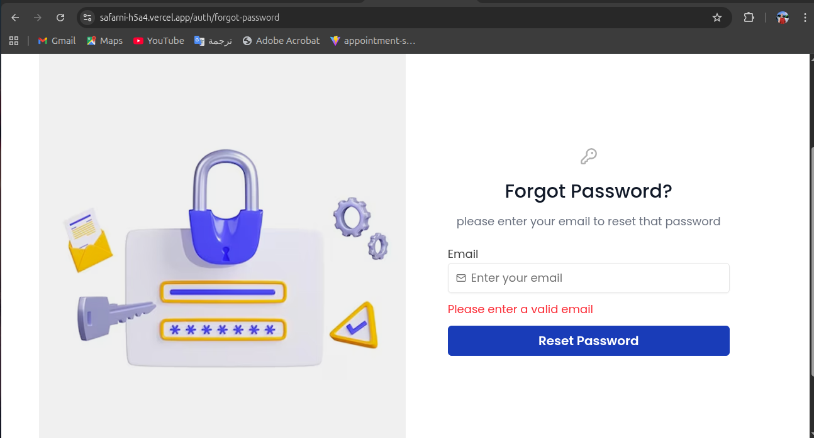
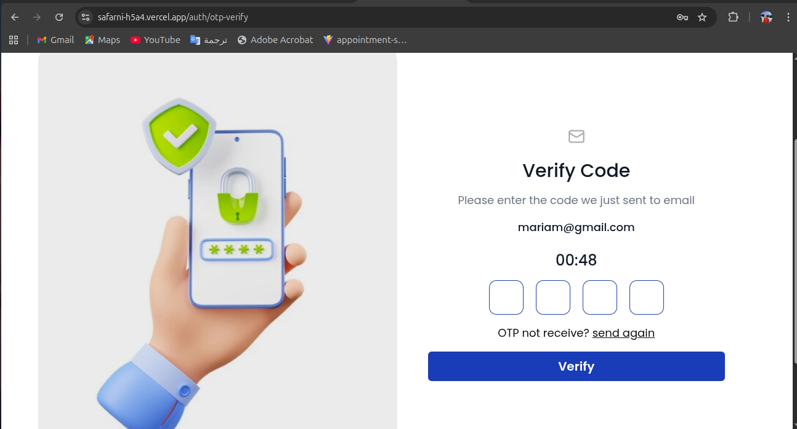
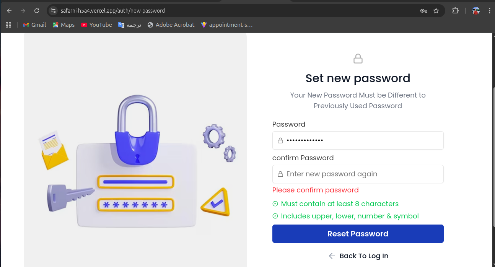

# Safarni-Tour Booking Platform

---

## 🔵 Project Overview

**Safarni** is a Tour Booking Platform that helps users explore tours, manage bookings, and have a smooth travel experience.  
It provides features like browsing places, booking services, and managing user accounts, all with an intuitive interface.

---

## 🟢 My Contribution (Frontend Focus)

I worked as a **Frontend Developer**, focusing mainly on the **Password Recovery Flow**, which includes **three screens**:

- ✅ **Forgot Password** – Users can enter their registered email to request a password reset  
- ✅ **OTP Verification** – Users receive a One-Time Password (OTP) to verify their identity  
- ✅ **Reset Password** – Users can set a new password
- ✅ Implemented form validation and input feedback using **React Hook Form** and **Zod**  
- ✅ Used **shadcn/ui** components for consistent styling  
- ✅ Managed asynchronous state and API interactions using **TanStack Query**  
- ✅ Designed responsive and user-friendly UI for all screens  

---

## ⚫ Technologies Used

- **React** (Functional Components & Hooks)  
- **Tailwind CSS**  
- **React Hook Form**  
- **Zod**  
- **TanStack Query**  
- **shadcn/ui**  

---

## 🟡 Screenshots

### Forgot Password

### OTP Verification

### Reset Password

---

## 🔴 Live Demo

Check the live project here:  
🔗 [Safarni App](https://safarni-h5a4.vercel.app/)

---

## 📌 Testing Hint

For testing OTP functionality, use:  
`1234`
